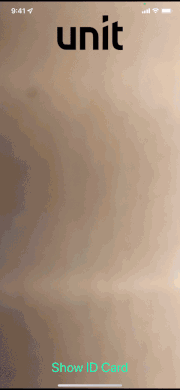
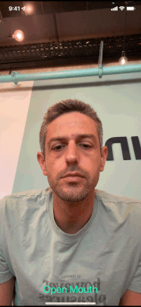
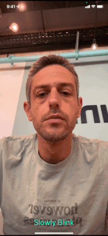
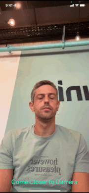

# Vocuhed SDK for iOS

## Introduction

Vouched provides a mobile SDK for iOS. The SDK provides the constructs to recognize, detect and ensure clear ID images. It also provides the constructs to recognize, detect, and prove liveness on faces. This low-level design allows you to rely on Vouched's AI expertise and still have complete control over the UX. <br/>
This is a helper guide that intends to clarify the process of implementing the [Vouched SDK](https://github.com/vouched/vouched-ios#run-example). 

## Prerequisites
   - A Vouched Public Key 
   - Clone and run the [Vouched Example app](https://github.com/vouched/vouched-ios#run-example)
   - Follow the steps listed on the [example README](https://github.com/vouched/vouched-ios/blob/master/Example/README.md)
     - To create an xconfig file: choose File -> New -> File in your project. In the new file dialog, scroll down until you see the Configuration Settings File in the Other section.
     - Make sure you save your Development.xcconfig in the `Example` directory

  - Read the documentation for the [Unit Vouched Sample App](./UnitVouchSampleApp/README.md).
  - Clone and run this repo.
    - Verify that you entered a Public Key as specified in [Unit Vouched Sample App documentation](./UnitVouchSampleApp/README.md).


   - When reading this guide, refer to the files in the UnitVouchedSampleApp to understand how to implement the simplified code examples described in the Integration steps below into practice.


## Integrate Vouched SDK into your app 

## Install
Add the package to your existing project using Cocoapods.
```swift
pod 'Vouched'
pod 'Vouched/Barcode'
```
Run `pod install`

##### Permissions
Add the following permission to your 'Info.plist' file to add a message that the user will view when he first opens the app:
```
Key       :  Privacy - Camera Usage Description   
Value     :  <Your message>
```

## Integration steps

### Vocuhed SDK Configuration
In your `AppDelegate.swift` file import:
```swift
import VouchedCore
import VouchedBarcode
```
Then at your `didFinishLaunchingWithOptions` method add:
```swift
FaceDetect.register()
CardDetect.register()
BarcodeDetect.register()
```

### Vocuhed SDK flow
A flow consists of capturing an id, a selfie and then see Vouched results based on the captured images.
Add all the following code sections to the swift file in which you intend to integrate the Vouched SDK.
You can find an example of a file that integrates with Vouched SDK in UnitVouchedSampleApp in the `UNVouchedService.swift` file. <br/>

Import the followings to your file:
```swift
import TensorFlowLite
import VouchedCore
import VouchedBarcode
```

### VouchedSession

This class handles a user's Vouched session. It takes care of the API calls. Use one instance for each flow. We will extract the final results using this session.

#### Initialize
Replace "PUBLIC_KEY" with your Public Key and initialize the session in your integration file:

```swift
let session = VouchedSession(apiKey: "PUBLIC_KEY", sessionParameters: VouchedSessionParameters())
```

### VouchedCameraHelper
This class is introduced to make it easier for developers to integrate VouchedSDK and provide the optimal photography. The helper takes care of configuring the capture session, input, and output.

#### Configure
You can initialize the helper by specifying a Detector that you wish to use. We'll use the method
`configureHelper(_ detector: Detector.Type)` to simplify the configuration of the helper.
To use the helper you will need to create a UIView that will hold the captures, making the capturing container white-labeled, e.g. the user will not know he is using the Vouched SDK and you may brand the screen as you like:

<details>
   
   <summary>An illustration of a white-labeled ID capture (we selected the logo, the text, the confirmation view, and the "continue" button).</summary>
   

   
</details>

```swift
var previewContainer: UIView?
```

The difference between capturing different modes can be found in the `detectionOptions` value. There, you'll be able to choose your liveness checks.
To better understand the different types of liveness checks look at the [CardDetectOption](https://github.com/vouched/vouched-ios#carddetectoptions) and the [FaceDetectOptions](https://github.com/vouched/vouched-ios#facedetectoptions).

<details>
   
   <summary>Example for a mouth movement liveness check</summary>
   

   
</details>

<details>
   
   <summary>Example for a blink movement liveness check</summary>
   

   
</details>

<details>
   
   <summary>Example for a distance movement liveness check</summary>
   

   
</details>

```swift
private var helper: VouchedCameraHelper?
func configureHelper(_ mode: VouchedDetectionMode) {
    guard let previewContainer = self.previewContainer else { return }
    var options = VouchedCameraHelperOptions.defaultOptions
    var detectionOptions = [VouchedDetectionOptions]()
    switch mode {
    case .id, .barcode:
        detectionOptions = [VouchedDetectionOptions.cardDetect(CardDetectOptionsBuilder().withEnhanceInfoExtraction(true).build())]
    case .selfie:
        detectionOptions = [VouchedDetectionOptions.faceDetect(FaceDetectOptionsBuilder().withLivenessMode(.mouthMovement).build())]
    @unknown default: break
    }
    helper = VouchedCameraHelper(with: mode, helperOptions: options, detectionOptions: detectionOptions, in: previewContainer)
}
```

#### Start Capture
In order to start the capturing, add the following code:
``` swift
helper.startCapture()
```
Once the results are ready to process/submit, stop capturing (we'll use it later):
``` swift
helper.stopCapture()
```

#### Observe capturing results
`withCapture` function will serve as a delegate to obtain captured results. We will add this to the end of our helper declaration:
``` swift
helper = VouchedCameraHelper(
    with: mode,
    helperOptions: options,
    detectionOptions: detectionOptions,
    in: previewContainer)?.withCapture(delegate: { self.handleResult($0) })
```


##### Handle the results that were captured by the helper
Results of different modes will be handled in a slightly different way.

```swift
private func handleResult(_ result: CaptureResult) {
    switch result {
    case .id(let result):
        guard let result = result as? CardDetectResult else { return }
        handleIdResult(result: result)
    case .selfie(let result):
        guard let result = result as? FaceDetectResult else { return }
        handleSelfieResult(result: result)
    case .barcode(let result):
        handleBarcodeResult(result: result)
    case .empty:
        ...
    case .error(let error):
        ...
    @unknown default:
        ...
    }
}

```

When the result.step is .postable you can stop capturing and create a Vouched Job using the session.
A Vouched Job is Vouched response which contains the job id, results, errors and signals that have been generated during that stage of the verification flow.

```swift
// ID example
func handleIdResult(result: CardDetectResult) {
    switch result.step {
    case .postable:
        helper?.stopCapture()
        onConfirmIdResult(result as CardDetectResult)
    case .preDetected:
        // Show a message to the user
    case .detected:
        // Use instructions to guide the user (will be explained in the next section)
    @unknown default:
        // Show a message to the user
    }
}

func onConfirmIdResult(_ result: CardDetectResult) {
    // Inform the user that processing time will be required.
    do {
        let job: Job
        job = try self.session.postCardId(detectedCard: result)
        // Use the job returned from Vouched
    } catch {
        // Update for errors
    }
}
  
    
// Selfie example
func handleSelfieResult(result: FaceDetectResult) {
    switch result.step {
    case .postable:
        helper?.stopCapture()
        // Inform the user that processing time will be required.
        do {
            let job = try self.session.postFace(detectedFace: result)
            // Use the job returned from Vouched
        } catch {
            // Update for errors
        }
        
    case .preDetected:
        // Show a message to the user
    case .detected:
        // Use instructions to guide the user (will be explained in the next section)
    @unknown default:
        // Show a message to the user
    }
}

// Barcode example
private func handleBarcodeResult(result: DetectionResult) {
    helper?.stopCapture()
    // Inform the user that processing time will be required.
    // Barcode does not have a result.step field
    do {
        let job = try session.postBackId(detectedBarcode: result)
        // Use the job returned from Vouched
    } catch {
        // Update for errors
    }
}

```

If you want to learn more about the job response fields go the [Vouched API reference](https://docs.vouched.id/reference/submitjob-1) -> RESPONSES -> and select 200.


More fields are available at the Vouched API reference link.

#### Use Vouched SDK detection Instruction
Relevant instructions are obtained from the result that was captured. The instructions will guide the user through the Liveness detection and will also guide the photo capture. You can create custom messages to display to the user based on the result.instruction that Vouched returned using an Enum or a custom function(check the UnitVouchSampleApp's `Vouch+DescriptiveText.swift` file)

<details>
   
   <summary>An illustration of receiving instructions and presenting the user with personalized messages (in green) based on them</summary>
   

   
</details>

```swift
// Accesses an instruction
result.instruction
```
Instructions that are only available on id detection:
```swift
case .moveAway
case .holdSteady
case .lookForward
case .blinkEyes
```


Instructions that are only available on selfie detection:
```swift
case .openMouth
case .closeMouth
```
Instructions that can are available on both detections:
```swift
case .onlyOne // For multiple faces/ids
case .moveCloser
case .none // General message
```

#### Use Vouched SDK detection Insights
Insights categorize image analysis output signals for easier identification, which in many cases can provide a means of user guidance or insight with respect to image based issues.

<details>
   
   <summary>Example of an insight from Vouched that is generated (user has sunglasses), and we display a personalized message to the user (please take off your glasses)</summary>
   

   
</details>

```swift
case .nonGlare // Image has glare
case .quality // Image is blurry
case .brightness // Image is dark
case .face // Required visual markers could not be detected
case .glasses // Sunglass/Eyeglass worn by user
case .idPhoto // ID photo not detected
case .unknown // Unknown error
```

Look for insights after a job is created, update the user and retry capturing if needed. 
``` swift
// ID example
func onConfirmIdResult(_ result: CardDetectResult) {
    ....
    let insights = VouchedUtils.extractInsights(job)
    if(!insights.isEmpty) {
        // Update the user and retry capturing if needed.
    }
}
```

### Finish Capturing
After you used the session to post the captures to Vouched and got a job in return, get the verification results, which are also known as job results.
This is an object that Vouched returns that holds it's algorithms score thresholds for the different captures. You can find an example for using the results in the Vouched Example app in `ResultsViewController.swift` file.
``` swift
do {
    let job = try session!.postConfirm()
    job = job.result
    // handle job results
} catch {
    // Update for an error
}
```

If you want to learn more about the job results response fields go the [Vouched API reference](https://docs.vouched.id/reference/submitjob-1) -> RESPONSES -> select 200 -> result 


More fields are available at the Vouched API reference link.


You might be interested in the "confidences" field, which contains a confidence rating for the captures returned by Vouched algorithms (ranging from 0.0 to 1.0).


More fields are available at the Vouched API reference link.


### VouchedDetectionManager
This class is introduced to help guide the ID verification modes by processing job results returned by the Vouched API service, and generating the appropriate modes that are needed to complete ID verification.
- Id detection can be done without this class.
- It let's us access some of the different stages in the detection process with it's callbacks.
- It includes additional features including the ability to retry capturing and the ability to create a view that verifies the image that was taken.
- It can increase your verification abilities by recognizing additional sources of information based on the ID that your user submits. You can enable this behavior by using .withEnhanceInfoExtraction(true) when setting your helper's detectionOptions.

#### Callbacks
To access all the callbacks create the following class:
```swift
class DetectionCallbacks: VouchedDetectionManagerCallbacks {
    var onStartDetection: ((VouchedDetectionMode) -> Void)?
    var onStopDetection: ((VouchedDetectionMode) -> Void)?
    var onResultProcessing: ((VouchedResultProcessingOptions) -> Void)?
    var onModeChange: ((VouchedModeChange) -> Void) = { _ in}
    var validateSubmission: ((DetectionResult) -> Bool)?
    var detectionComplete: ((Result<Job, Error>) -> Void)?
}
```

#### Initialize the VouchedDetectionManager
```swift
var detectionMgr: VouchedDetectionManager?
func configureDetectionManager() {
    guard let helper = helper else { return }
    guard let config = VouchedDetectionManagerConfig(session: session) else { return }
    let callbacks = DetectionCallbacks()
    configureManagerCallbacks(for: callbacks)
    config.callbacks = callbacks
    detectionMgr = VouchedDetectionManager(helper: helper, config: config)
}
```


#### Start Detection
In order to start detection:
```swift
detectionMgr?.startDetection()
```

In order to stop detection:
```swift
detectionMgr?.stopDetection()
```

If there is a need to capture additional info the following closure will be called :
``` swift
callbacks.onModeChange = { change in
    // Instruct the user
}
```

Once the detection process is finished and there is a Job result the following closure will be called:
``` swift
callbacks.detectionComplete = { result in
    switch result {
    case .success(let job):
      ...
    case .failure(let err):
      ...
    }
}
```


### Debugging/Logging
Configure VouchedLogger to the destination and level desired. If not configured, VouchedLogger defaults to `.none` and `.error`

In your `AppDelegate.swift` file, at your `didFinishLaunchingWithOptions` method add:

```swift
VouchedLogger.shared.configure(destination: .xcode, level: .debug)
```

Destinations - where the log output is written

- .xcode (Xcode output)
- .console (Console app via [os_log](https://developer.apple.com/documentation/os/oslog))
- .none

Levels - the severity of the log

- .debug
- .info
- .error

The level is inclusive of more severe logs. i.e - `.debug` will also log `.info` and `.error`

